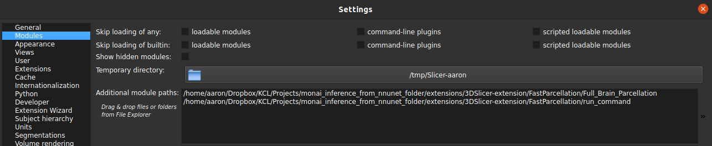
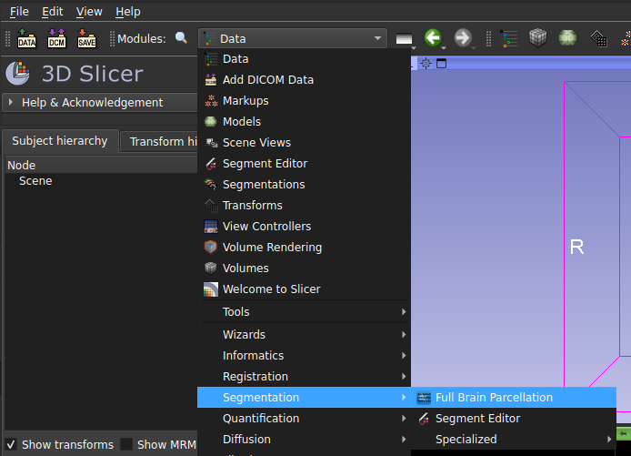
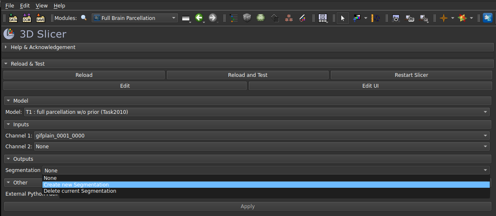

# 3D-Slicer plugin

A 3D-Slicer extension is available with which images can be loaded, inference can be run, and the output
parcellation can be viewed and 3D-rendered in 3D-Slicer. 

## Requirements
* 3D-Slicer (>=version 5.2.1: download [here](https://download.slicer.org/))

## Installation

1. Follow steps 1-3 of the core package instructions: {ref}`core/model_and_data_prep:Preparation of Model and Inference Data`
2. Follow 3D-Slicer installation instructions
3. Start 3D-Slicer
4. Go to Edit --> Application Settings --> Modules
5. Under "Add additional module paths" add the paths to the repository folders
`extensions/3DSlicer-extension/FastParcellation/Full_Brain_Parcellation` and
`extensions/3DSlicer-extension/FastParcellation/run_command`

    

6. Confirm the 3D-Slicer restart

## Run inference
1. After the restart, select the "Full Brain Parcellation" module as shown in this
screenshot:

    

2. Load an image into 3D-Slicer. This can be done by drag-and-dropping an image file on the 3D-Slicer module window. A
new window should pop up. Make sure the "Description" of the file is "Volume" and confirm the load with "OK". 
3. In the Fast Brain Parcellation module, select the model, the input image, and create a new segmentation under
the Segmentation drop-down menu:

   

4. Finally, start the inference with "Apply".